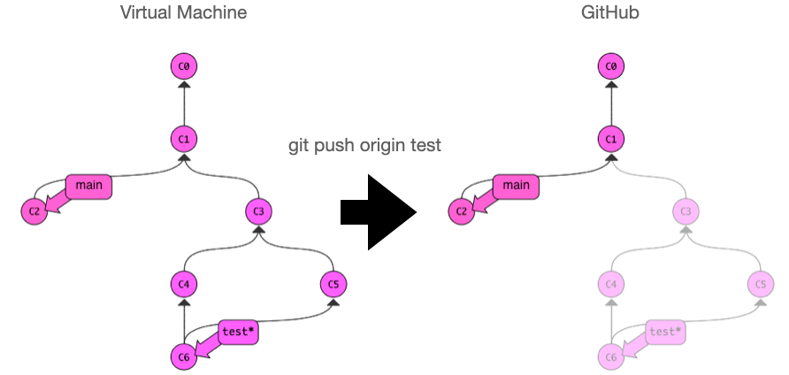
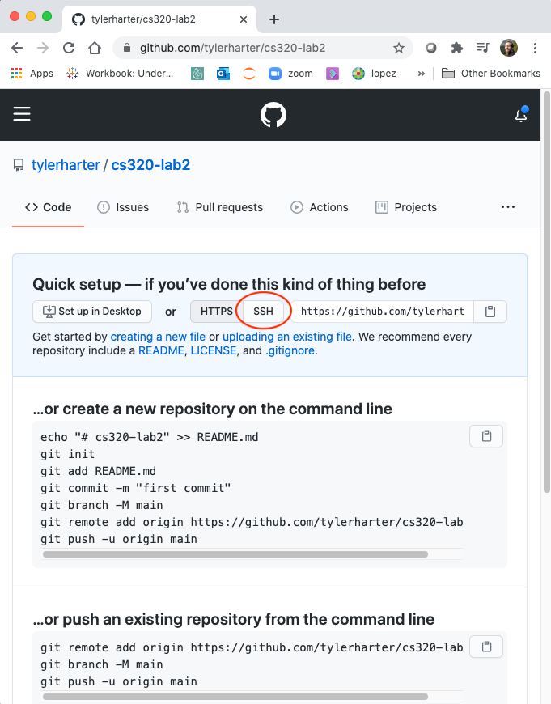
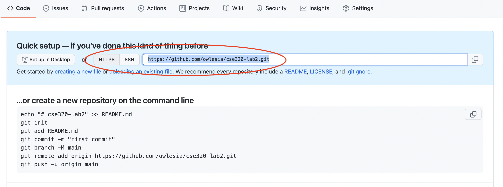
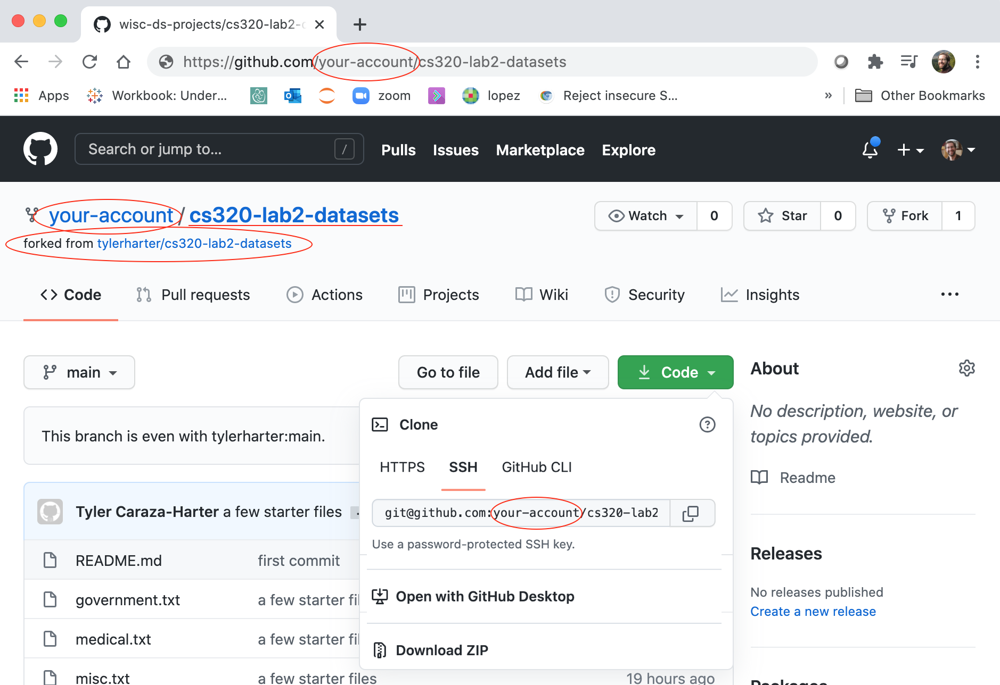

# GitHub

In this lab, you'll practice using git and GitHub.  You'll do the following:

1. create a GitHub account
2. create your own repo on GitHub, and push changes there
3. make tentative changes to someone else's GitHub repo, and create a "pull request" to recommend that the repo's owner integrate your changes

## Background

A **repo** contains a bunch of commits, and usually a few branches to
label different commits.  In order to support collaboration and
offline work, it is common to have multiple copies of the same repo.
For example, say there is a team of 3 people working on an open-source
project.  There will probably be six copies of the repo: one on each
person's laptop or virtual machine and one on each person's GitHub
account (with one of the GitHub ones being the primary home for the
code).

Various git commands and tools can be used to syncronize the copies.
For example, running `git push origin test` uploads the `test` branch,
and all the associated commits, to `origin`:



`origin` is an example of a **remote**, a shorthand name to use instead
of a full URL for a repo somewhere else (like GitHub).  When you
`clone` a repo from GitHub, you automatically get a remote called
`origin`, but you can setup more yourself.

`clone` is a one-time thing to make a new copy of a GitHub repo on
your computer and download all the commits/branches/etc.  If new
changes are made on the GitHub repo, you can instead run `git pull` to
download these without creating a whole new copy of the repo.

In addition to these three general git commands (**clone**, **pull**, **push**),
GitHub has two key tools for syncing repos:

* **fork**: copy somebody else's GitHub repo to a new repo (called a fork) on your account
* **pull request**: ask somebody to bring some new code you uploaded to your fork back into the main repo

Consider a concrete example of how to use all these commands.  Say you find a bug in `pandas`, fix it, and want to share the fix back.  You might do the following:

1. find the pandas repo on GitHub
2. clone the pandas repo to a copy on your computer
3. fork the pandas repo to a copy in your own GitHub account
4. make the change to the copy on your computer
5. add a remote so that you can push from your computer to your GitHub fork
6. do a push to upload your changes from your computer to your fork
7. do a pull request from your fork to the main pandas repo
8. somebody in charge of main repo will consider your changes, and probably (a) click a button on GitHub to incorporate your changes, or (b) give you feedback to make the code better first, in which case you go back to step 4

## Step 2: Create GitHub Account

Go to http://github.com/ and create a GitHub account (choose a name
that wouldn't embarrass you on a resume):


Later, running certain git commands will make you type your GitHub
password each time, unless you setup an SSH key to use instead of a
password (you likely setup an SSH key during the first lab to access
your virtual machine).  It's recommended (but not required) that you
configure GitHub with an SSH key following [these directions](ssh.md).

**Important:** for participation credit, fill [this form](https://forms.gle/BiyfdLRjuGmgcz2t8) so that we know you
  completed this part.  Associating your GitHub name with your
  @wisc.edu user will also let us give you credit for pull requests
  you might make to improve the course.

## Step 3: Create a Repo

Go to https://github.com/new and create a public repo called
"cs320-lab2". Do NOT initialize the repo by clicking on any checkbox at this step. Do NOT select "Add a README file".


This should create a repo at https://github.com/tylerharter/cs320-lab2
(with your username instead of "tylerharter").  Go to that URL, and
you'll see something like this:



Copy the commands in the "create a new repository box".  We want to run those in a new directory on your computer.  So run this in the terminal:

```
mkdir cs320-lab2
cd cs320-lab2
```

Then paste and run what you copied from GitHub. Enter your git username/password as necessary. If you are prompted to configure your github account on the VM after trying to commit, please do so. For example, you might need to: 

1. Set Git username and email if prompted:
```
git config --global user.name "your_github_username"
git config --global user.email "your_email"
```
2. If you are using HTTPS url instead of SSH, [create token](https://docs.github.com/en/authentication/keeping-your-account-and-data-secure/creating-a-personal-access-token) and use it when prompted to enter password.



Make sure there are no errors - you configured git if prompted, created commit and pushed it. Refresh the GitHub page for your repo at
https://github.com/tylerharter/cs320-lab2 (with your username instead
of "tylerharter").  You should now see the first commit, and the
content of your README.md:


Make another change to README.md on your computer (for example, say
"hello world"), push those changes to GitHub, then refresh the page.
Like this (one step at a time): 

```
nano README.md # make some changes, then save
git status
git add README.md 
git commit -m 'say hello'
git push
```

Keep in mind nano is a text editor. Do control-O to write the file. 

## Step 4: Pull Request

Visit this repo: https://github.com/tylerharter/cs320-lab2-datasets.
It contains a list of datasets in a few different .txt files.  For
this exercise, you'll add to the list, so spend a few minutes Googling
for an interesting dataset to add.

The repo is public, but that doesn't mean just anybody can make
changes to it via a git push.  Instead, if you think there should be a
change to a site (like the one above), the process goes like this:

1. make a copy of the GitHub repo, called a "fork", from the original account to your own account
2. download a copy of the original GitHub repo to your laptop or VM, using the clone command
3. make changes on your laptop or VM
4. push those changes to your own fork
5. make a formal request, called a "pull request", for the person of the original repo to integrate the changes on your fork into their codebase

Let's start.  Go back to the https://github.com/tylerharter/cs320-lab2-datasets page.  Click code, and copy the HTTPS address.


In the terminal, run this (the part after "git clone" was pasted from what you just copied):

```
git clone https://github.com/tylerharter/cs320-lab2-datasets.git
cd cs320-lab2-datasets
ls
```

Edit one of the existing .txt files, or create a new one (using nano,
or another editor if you prefer).  Add a link to the dataset you
found, and a brief description.

Run `git add file.txt`, replacing "file.txt" with the name of the file
you edited/created.  Run `git commit -m "choose your message here"`.

Now, if you were to try to do a `git push`, it would fail, because it
is trying to push to the original repo, where you don't have
permissions.

Going back to the repo on GitHub, click the "fork" button, copying the repo to your account:


Go to your newly forked repo, which is still named "cs320-lab2-datasets" like the original, but exists under your account (same URL as https://github.com/tylerharter/cs320-lab2-datasets, but with "tylerharter" replaced with your own user name):



Under the "Code" dropdown, **copy the address again**.  But instead of
cloning this as a new repo on your laptop or VM, we'll link it with the repo
on your laptop or VM that you got early by cloning the original repo from
GitHub repo.

Now, go back to the terminal, in the directory where you cloned the original repo.
Run `git remote -v`, and you'll see something like this:

```
origin	https://github.com/tylerharter/cs320-lab2-datasets.git (fetch)
origin	https://github.com/tylerharter/cs320-lab2-datasets.git (push)
```

A "remote" is the name for a link to a repo on GitHub, or some other
remote location.  The original remote is named "origin".  Let's add a
remote called "mycopy" that refers to your own forked repo on GitHub.
Run this, replacing "your-account" with your own GitHub name:

```
git remote add mycopy https://github.com/your-account/cs320-lab2-datasets.git
git remote -v
```

You'll see something like this:

```
mycopy	https://github.com/your-account/cs320-lab2-datasets.git (fetch)
mycopy	https://github.com/your-account/cs320-lab2-datasets.git (push)
origin	https://github.com/tylerharter/cs320-lab2-datasets.git (fetch)
origin	https://github.com/tylerharter/cs320-lab2-datasets.git (push)
```

Now, if you want to sync the last commit you made from the main branch
on your laptop/VM to GitHub, you have two choices:

1. `git push origin main` (push your changes to the original repo -- in this case, it will fail because I haven't added you as a "collaborator" to my repo)
2. `git push mycopy main` (push your changes in the main branch on your laptop or VM to your forked copy on GitHub)

Run the second command above, then revist your fork on GitHub:


GitHub has noticed you have an extra commit on your fork, and is
asking you if you want to create a "Pull request", to recommend your
changes back to the person who owns the original repo.  Click that.


Click "Create pull request".  This gives you the option to type a note to the person who will review your request, below which there is another "Create pull request" button, that you should click again.

If you go to https://github.com/tylerharter/cs320-lab2-datasets/pulls,
you'll see your pull request, along with all the others.  The person
owning the original repo will review these, deciding which suggested
changes to integrate and which to reject.

# Conclusion

Pull requests are neat -- they give you an easy way to make
improvements and recommend them to any public project on GitHub.  Even
amongst your own team, they provide a great way to get feedback on
changes in a fork before those changes become part of the main
repository.
