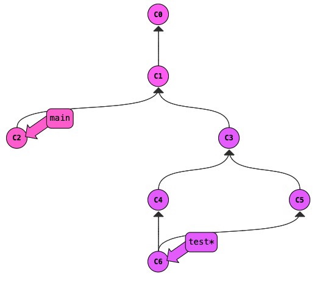
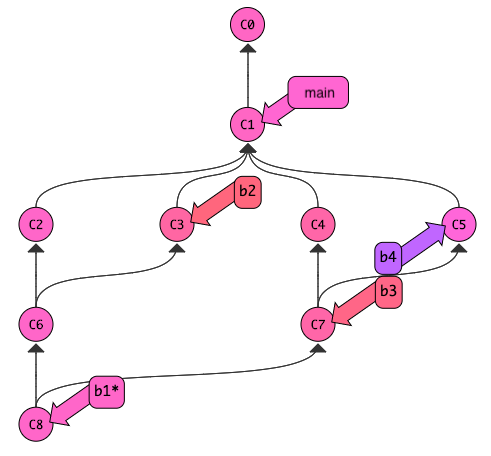

# Git Simulator

Let's start by practicing in the Git simulator <a
href="https://tyler.caraza-harter.com/cs320/learnGitBranching/index.html"
target="_blank">here</a>.  Try to run commands to get to the following state (if you get stuck, check the [solution here](solution.md)):

Useful commands for the above problem:
* `git commit`: make a new commit
* `git branch bname`: create a branch named `bname`
* `git checkout bname`: move `HEAD` to the commit referenced by the `bname`
* `git checkout c1`: move `HEAD` to the `c1` commit
* `git merge bname`: merge changes on the `bname` branch into the current branch
* `git branch -D bname`: delete the branch named `bname`

Ready for a real challenge?  Try to get to this state (no answer to
check for this one, so you'll need to work for it!):

**Hint:** start by creating commits on four branches, b1, b2, b3, and b4.
Merge b2 into b1 and b4 into b3.  Then merge the two merge commits
with a third merge commit.
