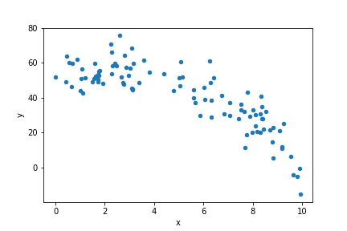

# Model Comparison

In this lab, we'll compare different polynomial regression models and
pick the one that best explains our dataset.

## Dataset

When learning new machine learning tools, it's often useful to
generate random datasets with some noise in them (instead of using
real data).  Then you know the real underlying pattern, and you can
see whether the model detects it.

First, randomly generate 100 x values uniformly between 0 and 10:

```python
import numpy as np
x = np.random.????(0, 10, ????)
x
```

Browse the numpy documentation to look for a function that can
generate random values uniformly in some range and click it to read
about the parameters and find an example that generates multiple
values at once:

https://numpy.org/doc/1.16/reference/routines.random.html

You should get something like the following (your random x values will of course differ):

```python
array([2.79687525, 3.79759323, 3.28057227, 0.53394018, 3.02631135,
       9.80546091, 9.52734311, 5.39445937, 0.88123164, 9.39220611,
       0.14952772, 9.98741116, 5.41985529, 0.53689649, 5.13812755,
       6.72324944, 6.85498995, 2.50218211, 2.69041511, 9.72999312,
       4.59943722, 8.66264111, 8.6791649 , 8.789668  , 1.97837428,
       7.41131163, 6.38631481, 8.01050144, 7.40393371, 8.52159954,
       6.86880071, 0.4429817 , 2.63150248, 9.70783847, 8.57701317,
       4.08390691, 1.53379304, 3.92925136, 5.59249091, 0.82697436,
       2.11395572, 3.45483354, 3.35563161, 7.71499755, 5.7887254 ,
       9.57698669, 1.45691284, 8.10710812, 1.51699873, 9.76220787,
       4.1302431 , 9.30973542, 6.55166107, 8.31202397, 2.75940007,
       0.74598903, 6.87346587, 2.9402988 , 3.47905205, 5.79509849,
       6.71840305, 7.42857789, 5.11721878, 9.41966954, 8.46706032,
       0.09892478, 6.11903957, 3.95076744, 0.22090436, 8.03670151,
       8.36679871, 6.47744917, 9.24849941, 1.56997753, 9.32665206,
       2.63553367, 0.42176439, 0.21810782, 6.18061177, 8.28879711,
       4.2926099 , 6.50542003, 1.05920583, 4.27601354, 9.65403314,
       4.58078682, 2.13464238, 1.11633827, 9.69418261, 6.16784997,
       1.45127682, 7.54690907, 4.454097  , 8.32580719, 6.64915113,
       9.44550501, 8.50366841, 5.77728997, 9.21509513, 3.05229763])
```

Put your x values in an `x` column of a new DataFrame:

```python
import pandas as pd
df = pd.DataFrame({"x": x})
df
```

Let's say we want the relationship between a y variable and our x
variable to be *y = 2x + 5*.  We can add the y column and plot the
relationship like this:

```python
df["y"] = df["x"] * 2 + 5
df.plot.scatter(x="x", y="y")
```

Let's say you want to add some random noise to the relationship.  Add

` + np.random.normal(scale=3, size=100)` to the end of the `df["y"] =
...` line, and look and the new scatter plot.

To create the data for the following work, modify the example as follows:

* use *y = 5x - x^2 + 50*
* use 8 for the scale of the noise

It should look roughly like the following:



## sklearn setup

Import the following from sklearn, and make the appropriate call to split `df` into train/test data:

```python
from sklearn.pipeline import Pipeline
from sklearn.preprocessing import PolynomialFeatures
from sklearn.linear_model import LinearRegression
from sklearn.model_selection import train_test_split, cross_val_score

train, test = ????(df)
len(train), len(test)
```

## 2nd Degree Model

Complete the following to create a 2nd degree regression model
pipeline that relates your y column to your x column and average
explained variance in the `scores_df` DataFrame:

```python
scores_df = pd.DataFrame()

degree = 2
model = Pipeline([
    ("poly", ????(degree=degree, include_bias=False)),
    ("model", ????()),
])
scores = cross_val_score(model, train[["????"]], train["????"])
scores_df.at[f"degree {degree}", "score"] = scores.mean()
scores_df.at[f"degree {degree}", "std_dev"] = scores.std()
scores_df
```

Create a bar plot with one bar showing the average explained variance
of the model and the standard devation of the scores:

```python
scores_df["????"].plot.bar(yerr=scores_df["????"])
```

## N Degree Models

Adapt the above example so that instead of `degree = 2` you loop over
multiple degrees with `for degree in range(????, ????):`.  Try all
degrees between 1 and 10.

Plot it as before:

```python
scores_df["score"].plot.bar(yerr=scores_df["std_dev"])
```

You should see something like this:


