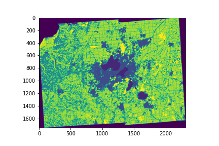

# Geographic Raster Data

In class, we learned geopandas, which is a *vector-based* GIS tool --
that means geo data is represented by vectors of coordinates, which
form polygons and other shapes.

*Raster* data is the other common kind of geo data you'll encounter.
 With raster data, you break land into a matrix, with numbers in each
 cell telling you something about the land at a given position.

In this part, we'll learn a bit about the `rasterio` module.  It will
help us create numpy arrays corresponding to how land is used in a
given WI county (this will be useful for predicting things like a
county's population).

First, install some packages:

```
pip3 install rasterio Pillow
```

P6 includes a `land.zip` dataset.  Let's open it (this assumes
your lab notebook is in the `p6` directory -- you may need to modify the path to
`land.zip` if you're elsewhere):

```python
import rasterio
land = rasterio.open("zip://../p6/land.zip!wi.tif")
```

This is the dataset for all of WI.  Let's say we want to only see Dane
County (which contains Madison).  We can get this from TIGERweb, a
service run by the US Census Bureau.

1. go to https://tigerweb.geo.census.gov/arcgis/rest/services/TIGERweb/
2. click "TIGERweb/tigerWMS_Census2020"
3. click "Counties (82)"
4. at the bottom, click "Query"
5. in the "Where" box, type `NAME='Dane County'` exactly
6. under "Format", choose "GeoJSON"
7. click "Query (GET)"
8. copy the URL

Paste the URL into the following code snippet:

```python
import geopandas as gpd
url = "????"
dane = gpd.read_file(url)
dane.plot()
```

You should see a rough outline of Dane County.

**NOTE: do not make requests to TIGERweb as part of P6.  We have
  already done so and saved the results in a geojson file we
  provide.**

We can use that outline as a *mask* on the raster data to get a numpy
array of land use.  A mask identifies specific cells in a matrix that
matter to us (note that we need to convert our geopandas data to the
same CRS as the rasterio data):

```python
from rasterio.mask import mask
matrix, _ = mask(land, dane.to_crs(land.crs)["geometry"], crop=True)
matrix = matrix[0]
```

Let's visualize the county:

```
import matplotlib.pyplot as plt
plt.imshow(matrix)
```

It should look like this:



Browse the legend here: https://www.mrlc.gov/data/legends/national-land-cover-database-2019-nlcd2019-legend

We see water is encoded as 11.  We can highlight all the water regions in Dane County like this:

```python
plt.imshow(matrix == 11)
```

Try filtering the matrix in different ways to see where the following land covers are dominant:

* Deciduous Forest
* Cultivated Crops
* Developed, Low Intensity
