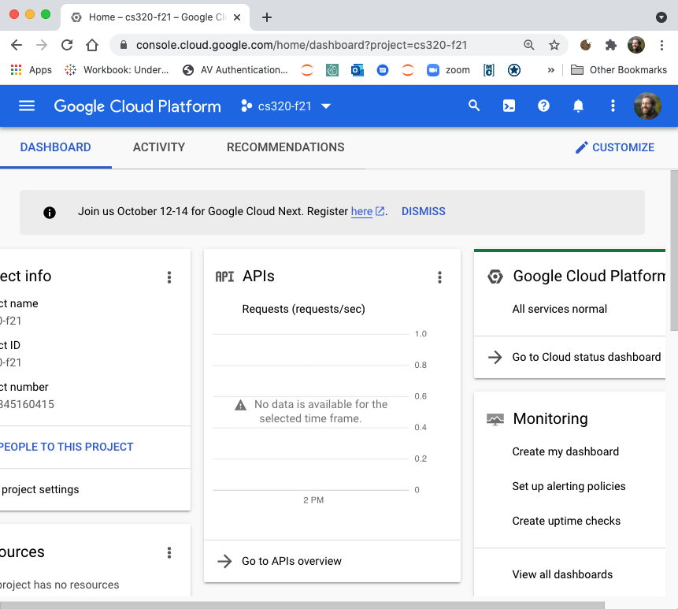

# Firewall Setup

What is a firewall?  First, a little background.

Remember from CS 220/301 that a computer (typically) has an *IP address*
(something like 123.234.210.001), and other computers knowing that IP
address can communicate with programs running on that computer.

If there are multiple running programs, they are differentiated by
*port numbers*.  For example, sending a message to 123.234.210.001:220
sends a message to the program on port 220 running on a computer with
address 123.234.210.001 (note the `:` between the IP address and port
number).  Sending a message to 123.234.210.001:320 might send a
message to a different program on that same machine.  Analogy: an IP
address is like the address of an apartment building (the computer),
and a port number is like the apartment number of a specific unit;
programs are the residents living in the units.

A Firewall (among other things) can block access to certain ports for
outsiders, to provide security.  We will unblock all ports for our
virtual machine.  This is not the most secure option, but it is
convenient, and fine for the purposes of this course.

1. Go to the Google Cloud Console at https://console.cloud.google.com/.  Then sign into your account.  Be sure your @wisc.edu user is selected (top right of blue bar) and that the "cs320-s22" project is also selected (to the left of the search box in the blue bar)!

2. In the menu on the left, scroll down to "Networking"; under that, open
the "VPC network" menu and select "Firewall"

3. if prompted, enable the "Compute Engine API".  This may take a couple minutes, and you probably need to re-click "Firewall" on the left after it finishes.

4. Click the "CREATE FIREWALL RULE" button

5. For the name and description, enter "cs320"

6. Under Targets, chose "All instances in the network".  Set "Source filter" to "IPv4 ranges" and "Source IP ranges" to "0.0.0.0/0".  Choose "Allow all" under "Protocols and ports".  Click "Create".

7. You should see the new "cs320" rule in the table:

