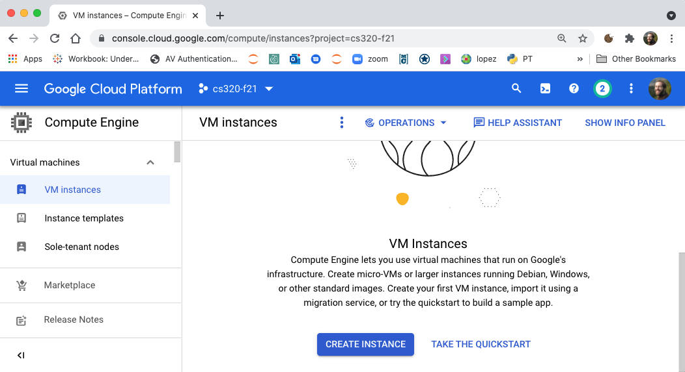
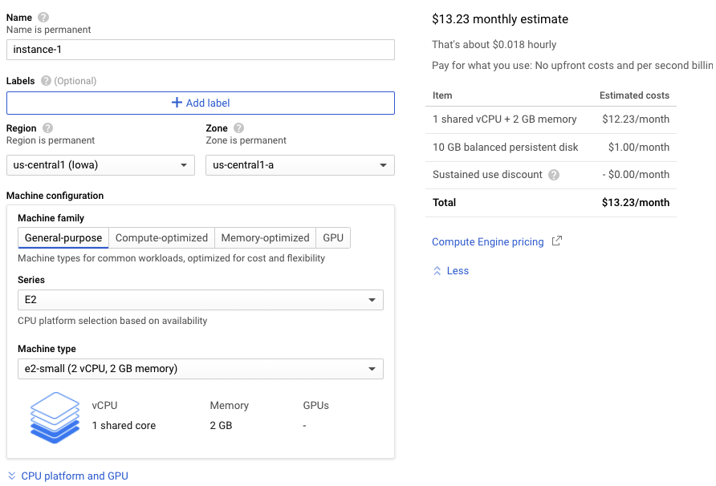
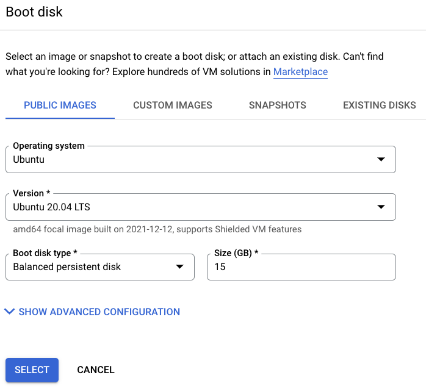

# Creating a Virtual Machine

1. in the menu on the left, expand the "Compute Engine" menu under
"COMPUTE" and click "VM Instances".  You should see the following, and you should click "CREATE INSTANCE".

2. under "Machine type" choose "e2-small".  Billing should be about
$13-14 a month, which will comes close to your $50 credit over the
course of the semester.

3. Scroll down to "Boot disk" and click "Change"

4. Select "Ubuntu" for the operating system.  Ubuntu is a popular
version of Linux (choosing a popular one is good because it's easier
to search for useful online suggestions when things go amiss).  Choose
"Ubuntu 20.04 LTS" for the version.  "LTS" stands for "Long Term
Support".  LTS versions aren't generally the most recent version, but
they're generally more reliable.  Update your boot disk to use 15 GB.

6. Further down, click to allow HTTP and HTTPS traffic, then click
"Create".  If you get an error (e.g., `e2 instances do not support
onHostMaintenance=TERMINATE unless they are preemptible`, deleting the
VM and retrying the creation sometimes works the second time)

7. You should see one instance here.  After the semester, or if you
ever want to start fresh with a new virtual machine, you may want to
delete the old virtual machines on this page.  Remember that you pay
per virtual machine (e.g., about $14/month for each small instance),
so it's a waste of money (or hopefully credits) to have more running
than necessary.

8. Make a note of the "External IP" -- you'll be using it again.
