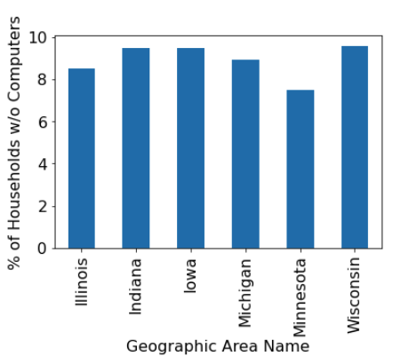
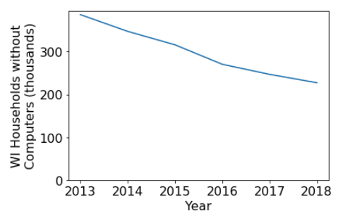
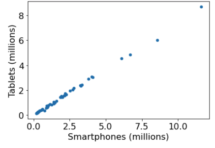

# Project 1: Review, Git Analysis, Benchmarking

## Corrections/Clarifications

* Q26: Change 20 earliest commits to 50 earliest commits to match solution

## Overview

This project is longer than usual, with 32 questions, because it is
designed to get familiar with Python basics (or review them if you
took 220).  The first 75% can be done as a group and focuses on
review.  The last 25% is individual and focuses on new 320 concepts.

Learning objectives:
* write code to control the flow of execution with loops, functions, and if statements
* extract values from Python state (variables, structures, etc), including nested list and dict structures
* use the Pandas package to read CSV files into DataFrames and analyze/plot the resulting data
* write code to analyze the history of a git project
* measure performance (how long it takes to run things)

**Note:** some browser's have a "dark mode" -- be careful not to use it when looking at plot examples (it often hides axis labels in the examples, which you need for full credit).

[VIDEO](https://mediaspace.wisc.edu/media/t/1_h3ej7cu2) showing how to get started (assumes you have completed lab 2).

## Setup

Make sure to do the week 2 lab before starting this, as it must be done on your
virtual machine.

1. SSH to your virtual machine using the following:

```
ssh USERNAME@IP_ADDRESS
```

If you don't recall these from lab, you can find your username
(https://console.cloud.google.com/compute/metadata/sshKeys) and
External IP address
(https://console.cloud.google.com/compute/instances) in Google's
console.

2. run `pip3 install pandas==1.4.4 matplotlib==3.5.3`

3. run `git clone https://github.com/cs320-wisc/f22.git`

4. go to `http://YOUR_IP_ADDRESS:2020/` in the browser (sign in, if prompted)

5. enter the `f22` > `p1` directory (expand the folder icon on the left of the screen if you don't see these directories)

6. click to create a new `Python 3 (ipykernel)` notebook

7. Go to "File" > "Rename Notebook", and name your notebook "p1.ipynb"

## Testing

1. do a "Kernel" > "Restart Kernel & Run All Cells" in your notebook

2. "File" > "Save Notebook"

3. from an SSH session, navigate to the f22/p1 directory

4. run `python3 tester.py p1.ipynb` and work on fixing any issues

## Submission

Your notebook should have a comment like this:

```python
# project: p1
# submitter: ????
# partner: none
# hours: ????
```

For submitter, use your NetID (part before @wisc.edu in your email).
Estimate how many hours you spent on the project.  This semester,
"partner" should always be "none".  Don't list people on your assigned
study group.

Submit as follows:

1. "File" > "Download as" > "Notebook (.ipynb)"

2. go to https://tyler.caraza-harter.com/cs320/f22/submission.html

3. select P1

4. "Choose File" to select the .ipynb file you had downloaded

5. "Submit" (don't use "Ignore Errors" unless you're right before a deadline -- better to email us to get help resolving the issue)

# Group Part (75%)

For this portion of the project, you may collaborate with your group
members in any way (even looking at working code).  You may also seek
help from 320 staff (mentors, TAs, instructor).  You <b>may not</b>
seek receive help from other 320 students (outside your group) or
anybody outside the course.

## Python Control Flow (Part 1)

### Q1: what is the type of `7/2`?

Take a look at the builtin Python functions to see if one can answer this: https://docs.python.org/3/library/functions.html

Some functions we use a lot in 220/320 are abs, dir, float, input, int, len, list, max, min, range, set, sorted, str, sum, type.

7 and 2 are ints, so the result of dividing these is an int (3, after rounding down 3.5) in most programming languages.  Python produces the mathematically correct answer, even though it is not an int (like 7 and 2).

In other cases where you want to divide 7 by 2 and get an int, you would use `7 // 2`.

### Q2: what is `error`?

Complete the code in accordance with the comment to calculate the answer.

```python
x = 4
maximum = 10
minimum = 5
error = ???? # True if x is outside the minimum-to-maximum range
error
```

Notes:
1. we don't need to specify the type of our variables as in some languages (e.g., Java) -- Python knows x is an `int` because we assigned `4`, which is an int.  Variable types are not fixed after creation as in some languages (e.g., Go) -- we could later run `x = "howdy"` if we wanted to
2. in Python, a `bool` is `True` or `False`.  We use the `and`, `or`, and `not` operators (in other programming languages, these operators are often expressed as `&&`, `||`, and `!`).

### Q3: ignoring case, does `word` end with the suffix "esque"?

Complete the following to answer:

```python
word = "KAFKAESQUE"
suffix_match = ???? # .endswith(...) method not allowed for this question! (practice slicing)
suffix_match
```

Skim string methods here: https://docs.python.org/3/library/stdtypes.html#string-methods.  Some important ones: `find`, `isdigit`, `join`, `split`, `lower`, `upper`, `strip`, `replace`.

Hints:
1. to ignore case, it's often easy to use a method to make everything upper or lower case
2. to get a single character from a string, you can use `s[INDEX]`.  0 is the first character, 1 is the second, and so on.  Python supports negative indexing, meaning `s[-1]` is the last letter, `s[-2]` is the next to last, etc.  You can also *slice* strings to get a substring by putting a colon between two indexes `s[inclusive_start:exclusive_end]`.  You can leave off one of the indexes to go to the start or end of the string.  For example, `word[:3]` would evaluate to `"KAF"`.
3. in Java, you compare strings with `s1.equals(s2)`, but in Python the correct equivalent is `s1 == s2`.  The equivalent of Java's `==` is Python's rarely used `is` operator.

Your function should generally take two ints and return their sum.  For example, `add(2, 3)` should return 5.  Users of the function should also be able to call it like `add(x=2, y=3)`.  If only one argument is passed, 1 should be added.  For example, `add(3)` or `add(x=3)` would both return 4.

Python parameters may be filled with positions arguments, keyword arguments, or default arguments.  If this is unfamiliar, read the following:

1. https://docs.python.org/3/tutorial/controlflow.html#defining-functions
2. https://docs.python.org/3/tutorial/controlflow.html#more-on-defining-functions

In Python, indents are very important.  The code inside a function/if/loop is indented (Python doesn't use `{` and `{` to indicate this, as in Java and many other languages).

### Q4: what is `add(3, 4)`?

Call your function to answer.

### Q5: what is `add(9)`?

### Q6: what is `status`?

Complete the following so that `status` says something meaningful about `x`.

```python
x = 4
if ????:
    status = "negative"
elif ????:
    status = "positive"
else:
    status = "zero"
status
```

https://docs.python.org/3/tutorial/controlflow.html#if-statements

### Requirement: `nums` list and `smart_count` function

Paste the following:

```python
nums = [3, 4, 1, 6]
for x in nums:
    print(x)
```

Python lists can be created like `[item1, item2, ...]` and indexed/sliced just like strings (strings and lists are both examples of Python *sequences*; by definition, you can index and slice any kind of sequence you encounter in Python).  This list contains just ints, but you're free to have a mix of types in Python lists.

In general, you can plug in a variable name and sequence into a `for` loop to run a piece of code for every entry in the sequence:

```python
for ???? in ????:
    # DO SOMETHING
```

More on `for` loops:
* https://docs.python.org/3/tutorial/controlflow.html#for-statements
* https://docs.python.org/3/tutorial/controlflow.html#break-and-continue-statements-and-else-clauses-on-loops

Write a function called `smart_count` that takes a list of numbers and returns their sum.  It should also have the following features:
1. ignore numbers greater than 10
2. if there is a negative number, that number (and all that follow it, positive or negative, should be skipped)

Use `continue` to implement feature 1 and `break` to implement feature 2.

### Q7: what is `smart_count(nums)`?

### Q8: what is `smart_count([2, 1, 11, 3, 15, -1, 8, 2])`?

The answer should be 6: 2+1+3.  11 and 15 are too large, so they are skipped.  8 and 2 are skipped because they are after a negative number (which is also skipped).

## Python State (Part 2)

### Requirement: lists and dicts

Copy/paste the following:

```python
header = ["A", "B", "C"]

coord1 = {"x": 8, "y": 5}
coord2 = {"x": 9, "y": 2}
coord3 = {"x": 3, "y": 1}

rows = [
    [1, 6, coord1],
    [3, 4, coord2],
    [5, 2, coord3],
]
```

Note that `rows` is a list of lists.  Each inner list contains two ints and one dict (dictionary).  For complicated nested structures like this, it's often helpful to visualize the stack of frames and heap of objects in PythonTutor: https://pythontutor.com/live.html#mode=edit.

You could copy the above to visualize it, or use the following link for your convenience:

https://pythontutor.com/visualize.html#code=header%20%3D%20%5B%22A%22,%20%22B%22,%20%22C%22%5D%0A%0Acoord1%20%3D%20%7B%22x%22%3A%208,%20%22y%22%3A%205%7D%0Acoord2%20%3D%20%7B%22x%22%3A%209,%20%22y%22%3A%202%7D%0Acoord3%20%3D%20%7B%22x%22%3A%203,%20%22y%22%3A%201%7D%0A%0Arows%20%3D%20%5B%0A%20%20%20%20%5B1,%206,%20coord1%5D,%0A%20%20%20%20%5B3,%204,%20coord2%5D,%0A%20%20%20%20%5B5,%202,%20coord3%5D,%0A%5D&cumulative=false&curInstr=7&heapPrimitives=nevernest&mode=display&origin=opt-frontend.js&py=3&rawInputLstJSON=%5B%5D&textReferences=false

Both lists and dicts contain values.  With lists, each value is associated with an index (integers starting from 0).  With dicts, each value is associated with a key specified by the programmers.  Keys are often strings, but they don't need to be.

Docs:
* https://docs.python.org/3/tutorial/datastructures.html#more-on-lists
* https://docs.python.org/3/tutorial/datastructures.html#dictionaries

**Testing Note:** try running `{"A":1, "B":2} == {"B":2, "A":1}` in Python.  Note that these two dicts are considered equivalent since they have the same values corresponding to the same keys.  So if the tester complains about any of your dicts (or sets) being wrong, the issue is with the contents, not the order.

### Q9: after inserting a "z" key in `coord3` (with `coord3["z"] = 3.14`), what is `rows`?

### Q10: what is the value associated with the "x" key of the dict in the last position of the first list?

**Hint:** if the question were "what is the value associated with the 'y' key of the dict in the last position of the second list?", the solution would be: `rows[1][-1]["y"]`.  You just need to tack on brackets containing indexes (for lists) or keys (for dicts) to delve deeper into a nested structure.

### Q11: what is `rows` after running the following?

Complete the following so that the first change via `v2` is NOT reflected in `rows`, but the second change via `v2` IS reflected in `rows`:

```python
import copy
v2 = ????
v2[0] = 8888    # first change
v2[1][1] = 9999 # second change
```

Relevant docs: https://docs.python.org/3/library/copy.html

To get a good intuition about the reference/shallow/deep copy, try stepping through the following slowly in PythonTutor:

```python
import copy
v1 = [[1], [], [2, 3]]
v2 = v1
v2 = copy.copy(v1)
v2 = copy.deepcopy(v1)
```

### Q12: if we imagine the list of lists structure referenced by `rows` as a table, with column names in `header`, what is the sum of values in the "B" column?

Note: the "B" column corresponds to the values at index in 1 of each list, but you are not allowed to hardcode 1 for this solution.  Instead, use `header.index(????)` to look up the position of "B" within the `header` list.

### Q13: what is `rows` after we sort it in-place by the "B" column, ascending?

Docs:
* https://docs.python.org/3/howto/sorting.html#sorting-basics
* https://docs.python.org/3/howto/sorting.html#key-functions

Hint: if we had to sort by the "A" column **descending**, we could do the following:

```python
def get_column_a(row):
    print("lookup A column for a row")
    return row[header.index("A")]

rows.sort(key=get_column_a, reverse=True)
rows
```

Note that we aren't calling `get_column_a` ourselves (because there are no parentheses after it on the sort line).  Instead, we're giving the `sort` method a reference to that function; this allows `sort` to call the function on each row, to figure out what part of the row objects matters for the sort.

When we only need a function for one purpose, we can use the `lambda` syntax instead of the `def` syntax to define the function on a single line, without even giving it a name.  The following works the same as the earlier example (but without the print):

```python
rows.sort(key=lambda row: row[header.index("A")], reverse=True)
rows
```

### Q14: say you're going on vacation to Europe with 400 US dollars; how many Euros can you get at the current exchange rate?

This site provides exchange rate information in JSON format: https://www.floatrates.com/json-feeds.html.  JSON is a simple format that can represent nested dicts and lists in files and web resources.

Download a copy of `usd.json` to the directory where your project is.  An easy way is to open a terminal, `cd` to the appriate directory, then run `wget SOME_URL_HERE` to download the web resource.

Note: you can run shell commands in Jupyter, too, if you start the command with a `!` (to indicate it is not Python code).  If you do this, be sure to delete the cell after the download.  Otherwise you'll create too much traffic on the floatrates.com site, re-downloading the same thing every time you re-run your notebook.

You can read a file like this:

```python
f = open("usd.json")
data = f.read()
f.close()
```

Check the type of `data` and the first portion of it:

```python
print(type(data))
print(data[:300] + "...")
```

Even though the file contains a string that *could* be interpreted as JSON, Python won't *deserialize* it to Python dicts/lists automatically.  Instead of calling `.read()`, we need to use the `load` function in the `json` module:

https://docs.python.org/3/library/json.html#json.load

When reading documentation, start by focusing on parameters that can't take default arguments.

### Requirement: `divide` function

Normally, if you divide by 0, you'll get an exception.  Write a function that does division; when there is such an exception, is should catch it and return the float `nan` (not a number).

How to catch exceptions: https://docs.python.org/3/tutorial/errors.html#handling-exceptions

To get `nan`, you can convert a string: `float("nan")`

Requirement: the function should only catch the exception that gets thrown for division by zero (not other exceptions).  To find the name of this exception, you could try doing a simple division by zero in a cell and observe what gets thrown.

### Q15: what is `divide(3, 2)`?

### Q16: what is `divide(-3, 0)`?

## Python Data Science (Part 3)

The US Census Bureau conducts the ACS (American Community Survey) yearly, asking a variety of questions.  The following gives data on household computer use from the years 2013 to 2018:

https://data.census.gov/cedsci/table?t=Computer%20and%20Internet%20Use&g=0100000US%240400000&tid=ACSDT1Y2015.B28001&hidePreview=true&tp=true&moe=true

We have downloaded the data for each year to a file in the `home-computers` directory.

Create a dictionary called `years` like this:

* **key**: a year (int), corresponding to a year of data in the directory.  Don't hardcode the years -- use `os.listdir` and extract the year from each filename (right before the first `.`).
* **value**: a pandas DataFrame corresponding to the CSV for that year.  Skip the first row from each CSV file: https://pandas.pydata.org/pandas-docs/dev/reference/api/pandas.read_csv.html.  Use `set_index` (https://pandas.pydata.org/docs/reference/api/pandas.DataFrame.set_index.html) to make "Geographic Area Name" the index of the DataFrame.  This will let you easily look up state stats by name (instead of by row number) later.

### Q17: what are the keys in `years`?

Answer with a sorted list.

### Q18: how many households did Wisconsin have in 2018?

The answer is in row 49 and column 1.  The hardcoding way to answer (not allowed) would thus be this:

```python
df = years[2018]
df.iat[49, 1] # iat works like df.iloc[49, 1], but is faster for one cell
```

Instead of hardcoding 49 and 1, you can use "Wisconsin" (row index name) and "Estimate!!Total" (column name).  When using names instead of positions, you just need to use `.at` or `.loc` (instead of `.iat`).

### Q19: how many total households in the US are estimated to not have any computer at home? (2018)

The data is in the "Estimate!!Total!!No Computer" column.

If `df` is a DataFrame, `df["some column name here"]` will extract an individual column as a Pandas Series.  A Pandas Series is like a list/dict hybrid.  You can use `.iat` to look up values by integer position (like you would with a list).  You can use `.at` to look up values by the Series' index, like you would with a dict.  Note the confusing terminology here: a Series' index is like a dict's key, and the "i" in "iat" does NOT refer to "index".

If you have a Pandas Series `s`, you can do various aggregations on it, like `.mean()`, `.sum()`, `.max()`, etc.

### Q20: what is the biggest per-state margin of error for "No Computer", as a fraction of the total estimate? (2018)

The margin of error is given in the "Margin of Error!!Total!!No Computer" column.

You can divide one Pandas Series by another on an elementwise basis like this: `s3 = s2 / s1`.  You can then compute `s3.max()`.  Or better, see if you can combine everything into a one-line computation.

### Q21: for Wisconsin and adjacent states, what percent of households are estimated to be without a computer? (2018)

**States**: Illinois, Indiana, Iowa, Michigan, Minnesota, Wisconsin.

Answer with a `dict`, where the key is the state name, and the value is the percent.

### Q22: same question, but answer with a bar plot.

If you have a Series `s`, you can use `s.plot.bar()` or `s.plot.barh()`.  Be sure to set an axis label for the percent.

Example:



### Q23: how as the number of WI households without computers changed over recent years?

Answer with a plot like this:



### Q24: what is the relationship between household with smartphones and those with tablets?  (2018)

Answer with a plot like this:



Columns:
* "Estimate!!Total!!Has one or more types of computing devices!!Smartphone"
* "Estimate!!Total!!Has one or more types of computing devices!!Tablet or other portable wireless computer"

# Individual Part (25%)

You have to do the remainder of this project on your own.  Do not
discuss with anybody except 320 staff (mentors, TAs, instructor).

For this part, you'll do two things:
1. analyze the history of this project: https://github.com/pallets/flask.  We'll eventually learn how to use the flask module to build web applications -- for now we'll just analyze changes to the codebase over time.
2. measure how long various Pandas operations take

We have a copy of the flask repo in `flask.zip`.  Run `unzip flask.zip`.  If `apt` is not installed, follow the suggestion in the error message to install it.  If that doesn't work because you don't have admin permissions, re-run the suggested command with `sudo` in front of the suggestion (that runs the command as the super/root/admin user).

### Q25: what is the first line of output from `git log` when run in the `flask` repo directory?

If you pass `cwd="????"` to `check_output`, you can run the `git log` command inside the `flask` directory that was created when you ran the `git clone` command.  "CWD" stands for "change working directory".

`check_output` function in the `subprocess` module (https://docs.python.org/3.8/library/subprocess.html#subprocess.check_output) returns a byte sequence; consider converting it to a string ("utf-8" encoding) and splitting it by newline (`\n`) to get a list. This will be useful for answering following questions.

**Important:** if you use "git checkout" commands (as required for following exercises) to switch the current (HEAD) commit, the output of "git log" will change (it will show the current commit and prior ones, but not future commits).  You may want to add some code that runs "git checkout main" to bring the HEAD back to the latest commit.  Otherwise your answer to this question might only be correct the first time you run the notebook.

### Q26: What are the commit numbers of the 50 earliest commits?

Answer with a list.  Commits with earlier dates should be later in the list.

### Q27: what did the `README` file contain after the 3rd commit?

Use `check_output` to run a `git checkout` command to switch to that commit, before reading `flask/README` the way you would read any regular text file in Python (using `open` and `.read`).

### Q28: how many pull requests were merged from each GitHub user?  Only output users who appear 5 or more times.

When running `git log`, you'll see some entries like this:

```
commit 7b0c82dfdc867641dd6e1b200f735bffd66e4c12
Merge: c5ca1750 a841cfab
Author: David Lord <davidism@gmail.com>
Date:   Wed Dec 22 17:10:24 2021 -0800

    Merge pull request #4350 from olliemath/patch-1
    
    Only use a custom JSONDecoder if needed
```

This means the code was approved by David Lord (who has permission to make changes), but the code change was written and proposed by olliemath.

Whenever a line from `git log` contains the text "Merge pull request" and "/", extract the username immediately before the "/".  Count occurences of usernames in dictionary like the following:

```
{'pallets': 204,
 'pgjones': 14,
 'greyli': 42,
 'ThiefMaster': 11,
 'jeffwidman': 8,
 'garenchan': 8,
 'davidism': 45,
 'dawran6': 7,
 'untitaker': 20,
 'lord63-forks': 5,
 'methane': 5,
 'Winnetou': 6,
 'defuz': 6,
 'ThomasWaldmann': 13,
 'SimonSapin': 11}
```

Note: there will be some entries like the following that are actually undoing a pull request:

```
Revert "Merge pull request #859 from wvh/register_error_handler"
```

For simplicity, we'll count these just like the original pull requests.

### Q29: what is the output of `pip3 instal`?  (yes, the mispelling was intentional)

This one will be difficult because the command will fail, triggering
an exception.  First, run this by itself to determine what exception
type is thrown in this circumstance:

```python
check_output(["pip3", "instal"])
```

Now, adapt this code to get the output, regardless of whether the
program runs or fails:

```python
import subprocess

try:
    msg = check_output(["pip3", "instal"], stderr=subprocess.STDOUT)
except subprocess.???? as e:
    msg = e.output
```

Note that `stderr=subprocess.STDOUT` tells `check_output` that error
messages should be treated as regular output -- that let's us capture
the output with `e.output`.

### Q30: what is faster for looping over a DataFrame, `iterrows` or `itertuples`?

We'll want to generate test data of various sizes.  Use this function for that purpose:

```python
def rand_df(rows):
    return pd.DataFrame(np.random.randint(10, size=(rows, 4)),
                        columns=["A", "B", "C", "D"],
                        index=[f"r{i}" for i in range(1, rows+1)])
```

Answer with a plot as follows:
* x-axis is number of number of rows in a DataFrame
* y-axis is milliseconds is how long it takes to loop over the DataFrame
* two lines: one for `iterrows` and one for `itertuples`

If you have a DataFrame generated from `rand_df` called `df`, you can take a measurement like this:

```python
t0 = time()
# HOW LONG DOES THIS TAKE TO RUN, FOR DATAFRAMES WITH DIFFERENT NUMBERS OF ROWS?
for row in df.iterrows():
    pass
t1 = time()
```

Your plot should look something like this (we're hiding the legend labels so it's a surprise for you which is faster).


Some noise is OK as long as you get the same general shape (we get a slightly different plot each time we measure ourselves).

The easiest way to create a plot with two lines is to create a DataFrame with a column of measurements corresponding to each line.  Here's a simple example to adapt:

```python
times_df = pd.DataFrame(dtype=float)
times_df.at[1, "A"] = 50
times_df.at[2, "A"] = 60
times_df.at[1, "B"] = 35
times_df.at[2, "B"] = 34
times_df.plot.line()
```

### Q31: what is faster, `loc`, or `at`?

Answer with a line plot, similar to the one for the previous question.  Here is a code snippet to use for the measurement (adapt to measure `.at` as well):

```python
# HOW LONG DOES THIS TAKE TO RUN, FOR DATAFRAMES WITH DIFFERENT NUMBERS OF ROWS?
total = 0
for idx in df.index:
    for col in df.columns:
        total += df.loc[idx, col]
```

### Q32: what is faster, a loop or `.apply`?

Answer this one with a line plot similar as to the last two.  You should, however, have measurements going up to 20000 rows.

For the two code snippets to measure:

```python
# HOW LONG DOES THIS TAKE TO RUN, FOR DATAFRAMES WITH DIFFERENT NUMBERS OF ROWS?
result = df["A"].apply(laugh).tolist()
```

AND

```python
# HOW LONG DOES THIS TAKE TO RUN, FOR DATAFRAMES WITH DIFFERENT NUMBERS OF ROWS?
result = []
for val in df["A"]:
    result.append(laugh(val))
```

The `laugh` function is defined as follows:

```python
def laugh(x):
    return "ha" * x
```

