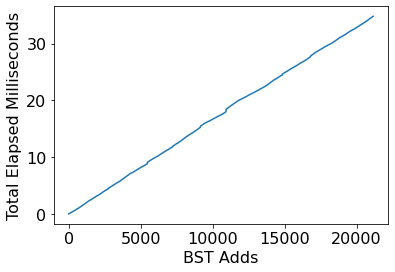
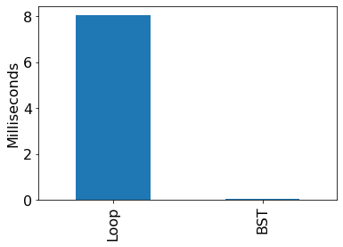

# DRAFT - Don't start yet!

# Project 2: Loan Analysis

## Corrections/Clarifications

## Overview

Sadly, there is a long history of lending discrimination based on race
in the United States.  Lenders have literally drawn red
lines on a map around certain neighbourhoods where they would not
offer loans, based on the racial demographics of those neighbourhoods
(read more about redlining here: https://en.wikipedia.org/wiki/Redlining).
In 1975, congress passed the Home Mortgage Disclosure Act (HDMA) to
bring more transparency to this injustice
(https://en.wikipedia.org/wiki/Home_Mortgage_Disclosure_Act).  The
idea is that banks must report details about loan applications and
which loans they decided to approve.

The public HDMA dataset spans all the states and many years, and is documented here:
* https://www.ffiec.gov/hmda/pdf/2020guide.pdf
* https://cfpb.github.io/hmda-platform/#hmda-api-documentation

In this project, we'll analyze every loan application made in Wisconsin in
2020.

Things you'll practice:
* classes
* large datasets
* trees
* testing
* writing modules

There's a lot of new stuff here, and students have often reported back
that P2 is the hardest of the semester, so we encourage you to start
early.

## Testing

Run `python3 tester.py p2.ipynb` often and work on fixing any issues.

## Submission

As last time, your notebook should have a comment like this:

```python
# project: p2
# submitter: ????
# partner: none
# hours: ????
```

You'll hand in 4 files:
* p2.ipynb
* loans.py (first module developed in lab)
* module_tester.py
* search.py (second module developed in lab)

Combine these into a zip by running the following in the `p2` directory:

```
zip ../p2.zip p2.ipynb loans.py search.py module_tester.py
```

Hand in the resulting p2.zip file.  Don't zip a different way (our
tests won't run if you have an extra directory inside your zip, for
example).

# Group Part (75%)

For this portion of the project, you may collaborate with your group
members in any way (even looking at working code).  You may also seek
help from 320 staff (mentors, TAs, instructor).  You <b>may not</b>
seek receive help from other 320 students (outside your group) or
anybody outside the course.

## Part 1: Loan Classes

Finish the `Applicant` and `Loan` classes from lab (if you haven't already done so): https://github.com/cs320-wisc/s22/blob/main/labs/lab4.md

We'll now add a `Bank` class to `loans.py`.  A `Bank` can be created like this (create an class with the necessary constructor for this to work):

```python
uwcu = loans.Bank("University of Wisconsin Credit Union")
```

### banks.json

The `__init__` of your `Bank` class should check that the given name appears in the `banks.json` file.  It should also lookup the `lei` ("Legal Entity Identifier") corresponding to the name and store that in an `lei` attribute.  In other words, `uwcu.lei` should give the LEI for UWCU, in this case "254900CN1DD55MJDFH69".

### wi.zip

The `__init__` should also read the loans from the CSV inside `wi.zip` for the given bank.  You already learned how to read text from a zip file in lab using `TextIOWrapper` and the `zipfile` module.

Read the documentation and example for how to read CSV files with `DictReader` here: https://docs.python.org/3/library/csv.html#csv.DictReader.  You can combine this with what you learned about zipfiles.  When you create a `DictReader`, just pass in a `TextIOWrapper` object instead of a regular file object.

As your `__init__` loops over the loan `dict`s, it should skip any that don't match the bank's `lei`.  The loan dicts that match should get converted to `Loan` objects and appended to a list, stored as an attribute in the `Bank` object.

### Special Methods

We don't tell you what to call the attribute storing the loans, but you should be able to print the last loan like this:

```python
print(uwcu.SOME_ATTRIBUTE_NAME[-1])
```

We can check how many loans there are with this:

```python
print(len(uwcu.SOME_ATTRIBUTE_NAME))
```

For convenience, we want to be able to directly use brackets and `len` directly on `Bank` objects, like this:
* `uwcu[-1]`
* `len(uwcu)`

Add the special methods to `Bank` necessary to make this work.

### Testing

Running `python3 tester.py p2.ipynb` does two things:

1. compute a score based on whether answers in your `p2.ipynb` are correct
2. get a second score by running `module_tester.py`, which exercises various classes/methods in `loan.py` (already done) and `search.py` (the next part)

Your total score is an average of these two components.

Try running `module_tester.py` now.  You should see the following (assuming you haven't worked ahead on `search.py`):

```
{'score': 40.0, 'errors': ['could not find search module']}
```

It should actually be possible to get 50.0 from `module_tester.py`
after just completing `loans.py`, but we left some tests undone so you
can get practice writing tests for yourself.

Open `module_tester.py` and take a look at the `loans_test`.  The
function tries different things (e.g., creating different `Loan` and
`Applicant` objects and calling various methods).

Whenever something works, a global variable `loans_points` is
increased.  There are also asserts, and if any fail, the test stops
giving points.  For example, here's a bit that tests the `lower_age`
method:

```python
    # lower_age
    assert loans.Applicant("<25", []).lower_age() == 25
    assert loans.Applicant("20-30", []).lower_age() == 20
    assert loans.Applicant(">75", []).lower_age() == 75
    loans_points += 1
```

You should add some additional test code of your choosing (based on
where you think bugs are most likely to occur).  When the additional
code shows that `loans.py` works correctly, it should add 4 points to
`loan_points`.  You could do this is one step (`loans_points += 4`),
or better, divide the points over the testing of a few different
aspects.

## Part 2: Binary Search Tree

Finish the `Node` and `BST` classes from lab (if you haven't already done so): https://github.com/cs320-wisc/s22/blob/main/labs/lab5.md

**Note:** if we haven't gotten to BSTs in lecture and lab yet, you can still work on some of the questions in parts 3 and 4, but you should wait to work on the ones related to trees.

Add a special method to `BST` so that if `t` is a `BST` object so that it is possible to lookup items with `t["some key"]` instead of `t.root.lookup("some key")`.

## Part 3: First Home Bank Analysis

For the following questions, create a `Bank` object for the bank named "First Home Bank".

### Q1: what is the average interest rate for the bank?

Skip missing loans where the interest rate is not specified in your calculation.

### Q2: how many applicants are there per loan, on average?

### Q3: what is the distribution of ages?

Answer with a dictionary, like this:

```
{'65-74': 21, '45-54': 21, ...}
```

### Tree of Loans

For the following questions, create a `BST` tree.  Loop over every loan in thebank, adding each to the tree.  The `key` passed to the `add` call should be the `.interest_rate` of the `Loan` object, and the `val` passed to `add` should be the `Loan` object itself.

### Q4: how many interest rate values are missing?

Don't loop over every loan to answer.  Use your tree to get and count loans with missing rates (that is, `-1`).

### Q5: how tall is the tree?

The height is the number of nodes in the path from the root to the deepest node.  Write a recursive function or method to answer.

# Individual Part (25%)

You have to do the remainder of this project on your own.  Do not
discuss with anybody except 320 staff (mentors, TAs, instructor).

## Part 4: University of Wisconsin Credit Union Analysis

Build a new `Bank` and corresponding `BST` object as before, but now for "University of Wisconsin Credit Union".

### Q6: how long does it take to add the loans to the tree?

Answer with a plot, where the x-axis is how many loans have been added so far, and the y-axis is the total time that has passed so far.  You'll need to measure how much time has elapsed (since the beginning) after each `.add` call using `time.time()`.

**Note:** performance and the amount of noise will vary from one virtual machine to another, so your plot probably won't be identical (this applies to the other performance plots too).



### Q7: how fast are tree lookups?

Create a bar plot with two bars:
1. time to find missing `interest_rate` values (`-1`) by looping over every loan and keeping a counter
2. time to compute `len(NAME_OF_YOUR_BST_OBJECT[-1])`



### Q8: How many applicants indicate multiple racial identities?

Answer with a bar graph, where the x-axis is number of races, and the y-axis is number of applicants. The y axis should represent the number of applicants with the corresponding x-axis number of race selections.

### Q9: How many leaf nodes are in the tree?
Write a recursive function or method to count the number of leaf nodes in the given BST.

### Q10: What is the second largest element in the Bank BST?
Write a recursive function or method to find the second largest element in the BST.