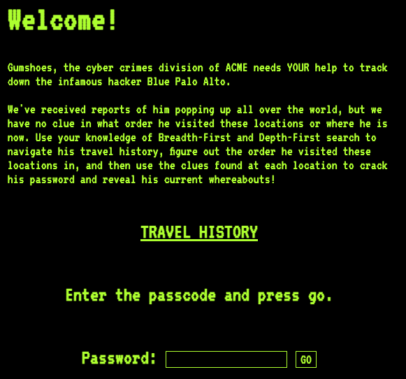

# Project 3: Find the Path!

## Corrections/Clarifications

* 10/17 - Updated `MatrixSearcher` class name to match class made in Lab 6.

## Overview

In this project you will practice inheritance, graph search, and web
scraping. You'll hand-in a module called `scrape.py`.

Make sure to run the tests before handing in.  During development, we
recommend having a debug.ipynb notebook to make calls to your module.

## Testing

Run `python3 tester.py` often and work on fixing any issues.

## Submission

You'll turn in one file (a Python module), `scrape.py`.  It should
have a comment like the following:

```python
# project: p3
# submitter: ????
# partner: none
# hours: ????
```

`scrape.py` will have the following
* GraphSearcher (a class)
* MatrixSearcher (a class)
* FileSearcher (a class)
* WebSearcher (a class)
* reveal_secrets (a function)

# Group Part (75%)

For this portion of the project, you may collaborate with your group
members in any way (even looking at working code).  You may also seek
help from 320 staff (mentors, TAs, instructor).  You <b>may not</b>
seek help from other 320 students (outside your group) or
anybody outside the course.

## Part 1: Base Class `GraphSearcher` and DFS on Matrices (`MatrixSearcher`)

Complete scrape.py from lab exercises if you haven't already done so:
https://github.com/cs320-wisc/f22/blob/main/labs/lab6.md

## Part 2: BFS on Matrix (`MatrixSearcher`) and Files (`FileSearcher` )

Add a `bfs_search` method to the base searcher `GraphSearcher`.  It should behave the same as
`dfs_search`, but use the BFS algorithm instead of DFS.  The
difference will be evident at the end if someone looks at the `.order`
attribute.

Note that without changing `MatrixSearcher`, it now supports both DFS
and BFS search since it inherits from `GraphSearcher`.

You could test your bfs implementation on `MatrixSearcher` by pasting the sample code to a `debug.ipynb` notebook in your `p3` directory.
```python
import pandas as pd
import scrape

df = pd.DataFrame([
    [0,1,0,1],
    [0,0,1,0],
    [0,0,0,1],
    [0,0,1,0],
], index=["A", "B", "C", "D"], columns=["A", "B", "C", "D"])

m = scrape.MatrixSearcher(df)
m.bfs_search(????)
m.order
```
From "A", for example, `m.order` should be `['A', 'B', 'D', 'C']`.  Look
back at the picture you drew of the graph and make sure you're getting
what you expect when starting from other nodes.


### `FileSearcher` Class

Add another class, `FileSearcher`, which also inherits from
`GraphSearcher`.  You job is to implement the three methods `__init__`, `visit_and_get_children`, and `concat_order` and inherit other methods.
1. `__init__`: the constructor of `FileSearcher` which does not take additional parameter besides the instance itself
2. `visit_and_get_children`: visit the file to record its value and get its children
3. `concat_order`: concatenate the values in `self.order` to a string

The nodes of this graph are files in the `file_nodes` directory.  For
example, `1.txt` contains this:

```
M
2.txt,4.txt
```

This means the value for node `1.txt` is "M", and the children of
`1.txt` are `2.txt` and `4.txt`.

All the files will have two lines like this, with a value on the first
line, and a comma-separated list of children on the second line.

The `visit_and_get_children` method should read a node file, record its vlaue in `self.order` and return a list of children.
The `concat_order` method should return all the values concatenated together.  

You could test this in your debug.ipynb notebook.:

```python
import scrape
f = scrape.FileSearcher()
print(f.visit_and_get_children("1.txt"), f.order, f.concat_order())
```

Expected result: `['2.txt', '4.txt'] ['M'] M`.  

Take a look at `bfs_test` in `tester.py` for an example of how `concat_order` should work.

In general, reading test cases is a great way to see how your classes
are supposed to work.  Specifications, like this document you're
reading now, are sometimes ambiguous (sorry!), but test cases tell you
what is expected from your code with complete precision.

It's often useful to copy/paste code snippets from `tester.py` to your
`debug.ipynb` when your debugging an issue too.

## Part 3: Web Crawling (`WebSearcher`)

Don't start this part until we learned about Selenium in class and how
to run it in "headless" mode.

For this part of the project you'll need to install Chrome and a few
packages on your VM:

```
pip3 install selenium==4.1.2 Flask lxml html5lib
sudo apt -y install chromium-browser
```

When it's all done, run both of the following, and verify that both
commands print the same version and it is 106+ (like "106.X.X.X", but it
may be a bigger number if there are browser updates before P3 is
complete):

```
chromium-browser --version
chromium.chromedriver --version
```

**Note**: launching many web browsers via code can quickly eat up
  all the memory on your VM.  You can run the `htop` command to see
  how much memory you have (hit "q" to quit when done).  If you're low
  on memory (you might notice your VM being sluggish), you can run
  `pkill -f -9 chromium` shutdown all browser instances hanging around
  in the background.

### Launching the Website

You'll be scraping a website implemented as a web application built
using the Flask framework (you don't need to know flask for this
project, though you'll learn it soon and get a chance to build your
own website in the next project).  In an SSH session, run the
following to launch it:

```
python3 application.py
```

Then, open `http://<YOUR-VM-IP>:5000` in your web browser. **Do not**
use the IP address that is printed to console in the ssh session (it
won't work).  It should look like this:



If you click "TRAVEL HISTORY", you'll enter a graph of pages, each
with a table fragment.  Your job is to search the graph (using the
search methods you wrote earlier), collect all the table fragments,
and concatenate them into one big DataFrame.

### `WebSearcher` Class

Write a `WebSearcher` class that inherits from `GraphSearcher`.  The
constructor should take a Chrome webdriver object as a parameter so
that it is possible to create `WebSearcher` object with `ws =
scrape.WebSearcher(some_driver)`.

For example, one could run the following:

```python
from selenium.webdriver.chrome.options import Options
from selenium.webdriver.chrome.service import Service
from selenium import webdriver

options = Options()
options.headless = True
service = Service(executable_path="chromium.chromedriver")
driver = webdriver.Chrome(options=options, service=service)

ws = scrape.WebSearcher(driver)
```

The `visit_and_get_children` method of `WebSearcher` should treat the node as a URL.  It
should use the webdriver to visit that page and return the URLs of
other pages to which the visited page has hyperlinks.  See `web_test`
in the tester for examples of how it should behave.

The `visit_and_get_children` method should also use the following to read any table
fragments on a visited page and store them somewhere (for example, in
an attribute):

https://pandas.pydata.org/pandas-docs/stable/reference/api/pandas.read_html.html

`WebSearcher` should have a `table()` method that
[concatenates](https://pandas.pydata.org/docs/reference/api/pandas.concat.html)
all the fragments in the order they were visited and returns one big
DataFrame.  Use `ignore_index=True` when concatenating.

### Manual Debugging

Here is a code snippet you can use as you write your methods to help
test whether they're working (be sure to replace `YOUR_VM_IP`!):

```python
import os
from selenium.webdriver.chrome.options import Options
from selenium.webdriver.chrome.service import Service
from selenium import webdriver
import scrape

# kill previous chrome instance if still around (to conserve memory)
os.system("pkill -f -9 chromium")

options = Options()
options.headless = True
service = Service(executable_path="chromium.chromedriver")
driver = webdriver.Chrome(options=options, service=service)

# TODO: use IP address of your VM
start_url = "http://YOUR_VM_IP:5000/Node_1.html"

s = scrape.WebSearcher(driver)
print(s.visit_and_get_children(start_url))

s = scrape.WebSearcher(driver)
s.bfs_search(start_url)

print(s.table())

driver.close()
```

Expected output:

```
['http://YOUR_VM_IP:5000/Node_2.html', 'http://YOUR_VM_IP:5000/Node_4.html']
    clue   latitude   longitude                          description
0      1  43.089034  -89.416128              Picnic Point in Madison
1      7  38.105507  126.910613               Silver Beach in Hawaii
2      1  65.044901  -16.712836  Shore of a Volcanic Lake in Iceland
3      3  48.860945    2.335773                  The Louvre in Paris
4      8  51.180315   -1.829659                 Stonehenge in the UK
5      5  37.434183 -122.321990      Redwood forest in San Francisco
6      2  27.987586   86.925002                 Mt. Everest in Nepal
7      4  34.134117 -118.321495                 Hollywood Sign in LA
8      5  38.655100   90.061800                 Cahokia Mounds in IL
9      9  40.748400   73.985700          Empire State Building in NY
10     4  29.975300   31.137600        Great Sphinx of Giza in Egypt
11     1  47.557600   10.749800     Neuschwanstein Castle in Germany
12     5  38.624700   90.184800        The Gateway Arch in St. Louis
13     3  30.328500   35.444400                      Petra in Jordan
14     2  41.480800   82.683400                    Cedar Point in OH
15     6  43.070010  -89.409450          Quick Trip on Monroe Street
```

# Individual Part (25%)

You have to do the remainder of this project on your own.  Do not
discuss with anybody except 320 staff (mentors, TAs, instructor).

## Part 4: `reveal_secrets` function

Write a function (remember that functions aren't inside any class) in
`scrape.py` like the following:

```python
def reveal_secrets(driver, url, travellog):
    ....
```

The function should do the following:

1. generate a password from the "clues" column of the `travellog` DataFrame.  For example, if `travellog` is the big DataFrame built after doing BFS (as shown earlier), the password will start with "17138..."
2. visit `url` with the `driver`
3. automate typing the password in the box and clicking "GO"
4. wait until the pages is loaded (perhaps with `time.sleep`)
5. click the "View Location" button and wait until the result finishes loading
6. save the image that appears to a file named 'Current_Location.jpg' (use the `requests` module to do the download, once you get the URL from selenium)
7. return the current location that appears on the page (should be "BASCOM HALL")

**Hints for step 6:** jpeg files are a binary format (they don't contain text for a human to read).  You'll need to do some searching online to learn how to (a) download binary data and (b) write it to a file.  Remember to cite any code you copy/paste.  Here are some example Google searches you might start with to find how to do these things:

* "how to write bytes to a file in python"
* "how to fetch a binary file with python requests"
