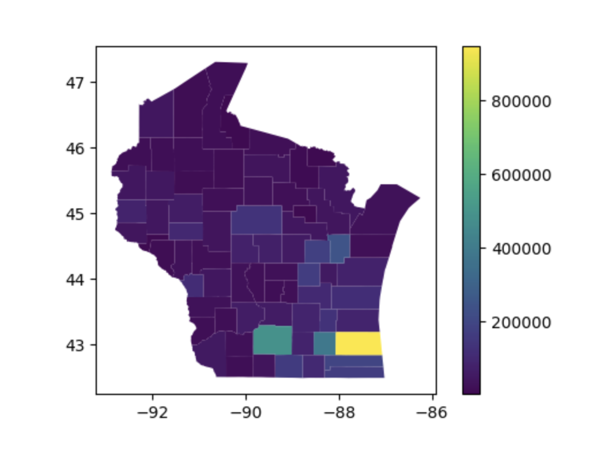
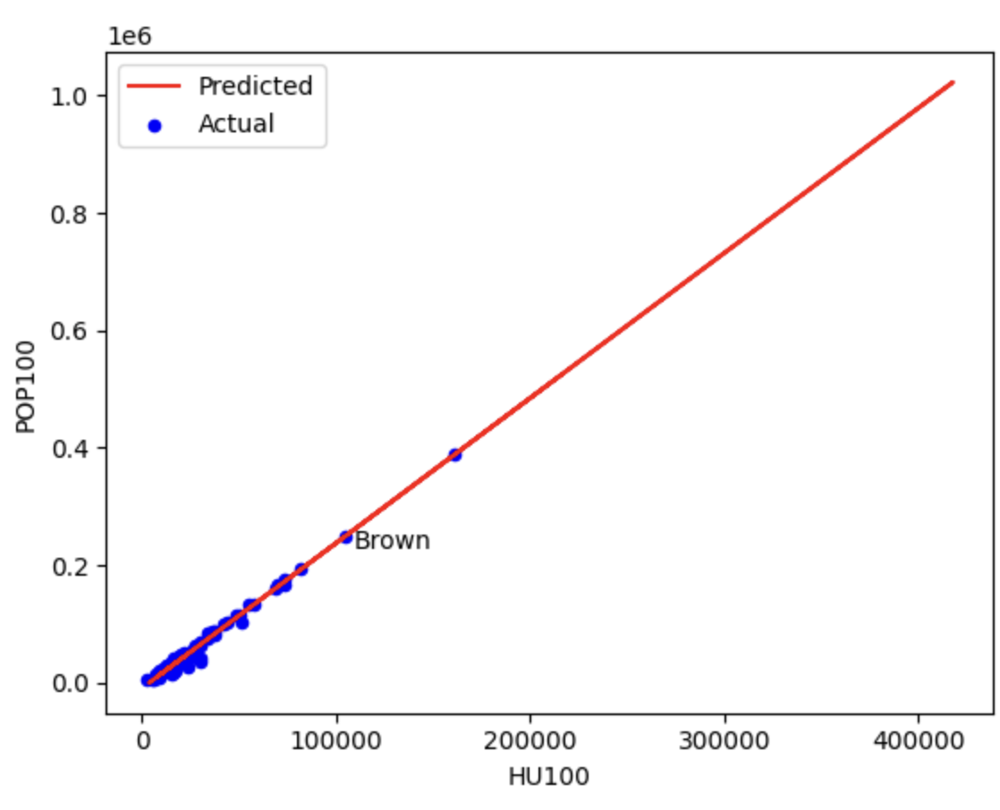
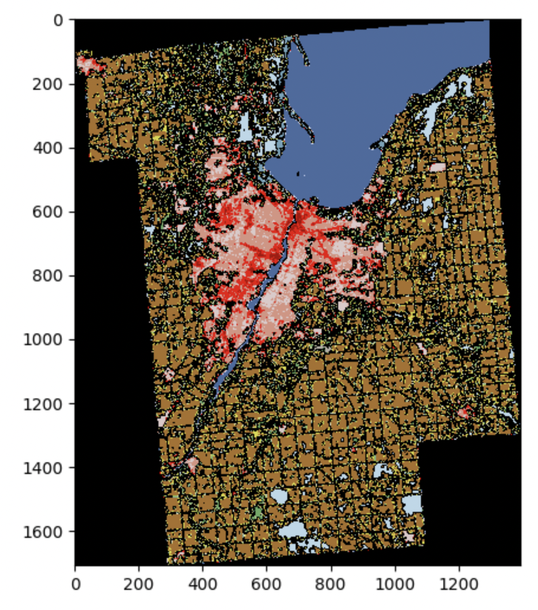
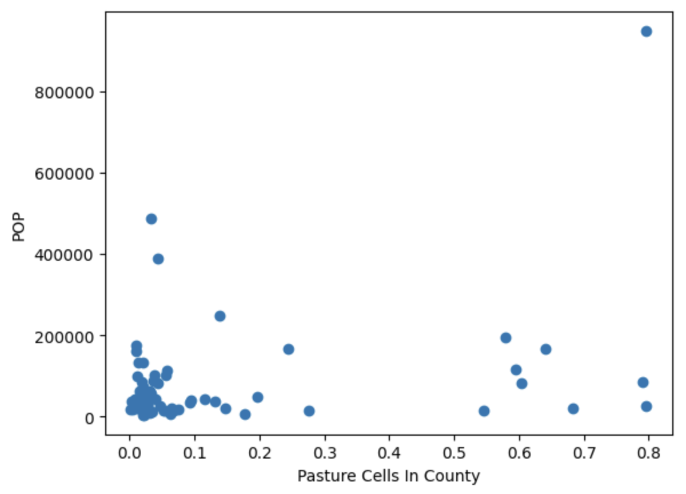

# Project 6: Regression Models

* none yet

## Corrections/Clarifications

* Nov 16: updated link to lecture examples from this semester

## Overview

We will be making predictions about census data for Wisconsin using
regression models. You'll need to extract data from four files to
construct DataFrames suitable for training during this project:

* `counties.geojson` - population and boundaries of each county in Wisconsin
* `tracts.shp` - boundaries of each census tract (counties are subdivided into tracts)
* `counties_tracts.db` - details about housing units per tract
* `land.zip` - details about land use (farm, forest, developed, etc.)

## Submission

Do all your work in a single p6.ipynb notebook file, and hand it in
when you're done.

To run the local tester on your own VM type from the command line

`python3 tester.py p6.ipynb`

# Group Part (75%)

For this portion of the project, you may collaborate with your group
members in any way (even looking at working code).  You may also seek
help from 320 staff (mentors, TAs, instructor).  You <b>may not</b>
seek receive help from other 320 students (outside your group) or
anybody outside the course.

## Part 1: Predicting Population using Area

### Q1: How many counties are in Wisconsin?

Read `counties.geojson` into a GeoDataFrame and use it to calculate the number of counties in Wisconsin.

### Q2: What is the population of each county in WI?

Create a geopandas plot that has a legend using the population from
the `POP100` column.



The US Census Bureau does some surveys that attempt to sample the
population and others (like the decennial one) that attempt to count
everybody.  "POP100" means this is there attempt to count 100% of the
population (no sampling).  Similarly, "HU100" is a 100% count of
housing units.

### Feature 1: `AREALAND`

Let's add an `AREALAND` column to your GeoDataFrame of counties so
that we can try to predict population based on area.

You can get the area from the `counties_tracts.db` database.  Open it using [sqlite3](https://docs.python.org/3/library/sqlite3.html)
then use [read_sql](https://pandas.pydata.org/docs/reference/api/pandas.read_sql.html) on the DB connection to execute a query.
A great first query for an unfamiliar DB is `pd.read_sql("""SELECT * FROM sqlite_master""", conn)`.  That will show you all the tables the DB has. Try running `pd.read_sql("""SELECT * FROM ????""", conn)` for each table name to see what all the tables look like.

Use data from the database to add an `AREALAND` column to your
GeoDataFrame.  The order of rows in your GeoDataFrame should not
change as part of this operation.

After you've added `AREALAND` to your GeoDataFrame, use
`train_test_split` from `sklearn` to split the rows into `train` and
`test` datasets.

* by default, `train_test_split` randomly shuffles the data differently each time it runs.  Pass `random_state=250` as a parameter so that it shuffles the same way as it did for us (so that you get the answers the tester expects).
* Pass `test_size=0.25` to make the test set be one quarter of the original data and the other three quarters remaining in the training set.

### Q3: What are the counties in the test dataset?

Answer with a list, in the same order as the names appear in the DataFrame.

### Q4: How much variance in the `POP100` can a `LinearRegression` model explain based only on `AREALAND`?

`fit` the model to your `train` dataset and `score` it on your `test` dataset.

### Q5: What is the predicted population of a county with 400 square miles of area, according to the model?

Consult the [Census documentation](https://tigerweb.geo.census.gov/tigerwebmain/TIGERweb_attribute_glossary.html) to learn what units the data is in, and do any conversions necessary to answer the question.  Assume there are exactly 2.59 square kilometers per square mile for the purposes of your calculation.

## Part 2: Predicting Population using Housing Units

You'll need to wait to do the lab before continuing: https://github.com/cs320-wisc/f22/blob/main/labs/lab12.md

### Feature 2: `HU100` (housing units)

Look at the `tracts` table inside `counties_tracts.db` and find the
`HU100` column. Add a `HU100` column to your GeoDataFrame of counties,
similar to how you added `AREALAND`.

**The query to get housing units per county is more complicated than the
one for AREALAND**.  County names are in the `counties` table and
`HU100` values are in the `tracts` table.  Fortunately, both tables
have a `COUNTY` column you can use to combine. Make sure to get the
total number of housing units for each county from the `tracts` table
by summing the housing units in each tract of the county.

Split your updated GeoDataFrame into a train and test set, the same
way you did previously.

### Q6: What are the counties in the test dataset?

Answer with a `list`, in the same order as the names appear in the DataFrame.

### Q7: What are the HU100 values for the counties in the test dataset?

Answer with a `dict`.

### Q8: How much variance in the `POP100` can a `LinearRegression` model explain based only on `HU100`?

Answer with the average of 5 scores [produced by `cross_val_score` on the training data](https://scikit-learn.org/stable/modules/generated/sklearn.model_selection.cross_val_score.html).

### Q9: What is the standard deviation of the cross validation scores from Q8?

### Q10: What is the formula relating POP100 and HU100?

Fit your model to the training dataset to find the answer. Round the coefficient and intercept to 2 decimal places. Format the answer according to the following formula:

```
POP100 = ????*HU100 + ????
```

### Q11: What is the relationship between HU100 and POP100, visually?

Answer with a scatter plot showing the actual values (both train and test) and the predicted fit line based on the model.

Use a `.text` call to annotate Brown County, and a legend to label the actual and predicted parts as in the following:



## Part 3: Land Use Features

### Q12: How many numbers in matrix `A` are between 3 and 6 (inclusive)?

You can paste the following to define `A`:

```python
A = np.array([
    [0,0,5,8,4],
    [1,2,4,0,3],
    [2,4,0,9,2],
    [3,5,2,1,1],
    [0,5,0,1,0]
])
```

### Q13: How does Brown County look?

NOTE: in lab, you had to use TIGERweb to get the geodata.  You
shouldn't do that here because we already did that saved the results
to `counties.geojson`, which you should use.  Otherwise, this is very
similar to the lab exercise.

You can show the image like this:

```python
fig, ax = plt.subplots(figsize=(6,6))
ax.imshow(????, vmin=0, vmax=255)
```

You can get the matrix for Brown County using `rasterio` and using the geometry in the DataFrame from `counties.geojson`.

You can also define a custom color map ([corresponding to the legend](https://www.mrlc.gov/data/legends/national-land-cover-database-2019-nlcd2019-legend) and pass `cmap=custom_cmap` to `imshow` to use it.

You can create a custom color map using `ListedColormap`, which lets you specify red, green and blue (RGB) mixes for different values.  Here's an example for the land use data:

```python
from matplotlib.colors import ListedColormap

c = np.zeros((256,3))
c[0] = [0.00000000000, 0.00000000000, 0.00000000000]
c[11] = [0.27843137255, 0.41960784314, 0.62745098039]
c[12] = [0.81960784314, 0.86666666667, 0.97647058824]
c[21] = [0.86666666667, 0.78823529412, 0.78823529412]
c[22] = [0.84705882353, 0.57647058824, 0.50980392157]
c[23] = [0.92941176471, 0.00000000000, 0.00000000000]
c[24] = [0.66666666667, 0.00000000000, 0.00000000000]
c[31] = [0.69803921569, 0.67843137255, 0.63921568628]
c[41] = [0.40784313726, 0.66666666667, 0.38823529412]
c[42] = [0.10980392157, 0.38823529412, 0.18823529412]
c[43] = [0.70980392157, 0.78823529412, 0.55686274510]
c[51] = [0.64705882353, 0.54901960784, 0.18823529412]
c[52] = [0.80000000000, 0.72941176471, 0.48627450980]
c[71] = [0.88627450980, 0.88627450980, 0.75686274510]
c[72] = [0.78823529412, 0.78823529412, 0.46666666667]
c[73] = [0.60000000000, 0.75686274510, 0.27843137255]
c[74] = [0.46666666667, 0.67843137255, 0.57647058824]
c[81] = [0.85882352941, 0.84705882353, 0.23921568628]
c[82] = [0.66666666667, 0.43921568628, 0.15686274510]
c[90] = [0.72941176471, 0.84705882353, 0.91764705882]
c[95] = [0.43921568628, 0.63921568628, 0.72941176471]
custom_cmap = ListedColormap(c)
```



### Q14: What portion of Brown County is "Open Water"?

Be careful!  Not everything in the matrix is Brown County -- be
sure not to count the cells with value 0.

You can lookup the numeric code for "Open Water" and other types here: https://www.mrlc.gov/data/legends/national-land-cover-database-2019-nlcd2019-legend

Or, for your convenience, we typed the info from that page into a Python dictionary:

```python
land_use = {"open_water": 11,
            "ice_snow": 12,
            "developed_open": 21,
            "developed_low": 22,
            "developed_med": 23,
            "developed_high": 24,
            "barren": 31,
            "deciduous": 41,
            "evergreen": 42,
            "mixed_forest": 43,
            "dwarf_scrub": 51,
            "shrub_scrub": 52,
            "grassland": 71,
            "sedge": 72,
            "lichens": 73,
            "moss": 74,
            "pasture": 81,
            "crops": 82,
            "woody_wetlands": 90,
            "herbacious_wetlands": 95}
```

### Q15: What is the Relationship Between POP100 and ________________?

Replace the blank with a cell count for a land type of your choosing.
Show a scatter plot where each point corresponds to a county.

For example, the following shows the relation between pasture and
population (you may NOT reuse pasture -- choose a different type for
your plot):



# Individual Part (25%)

You have to do the remainder of this project on your own.  Do not
discuss with anybody except 320 staff (mentors, TAs, instructor).

For this part, you'll try to predict population on a **per-census
tract** basis (in contrast to our preceding per-county analysis),
using features calculated from the land use data.  

## Part 1: 
1. start with a GeoDataFrame dataset loaded from `tracts.shp`
2. add feature columns to that dataset for every key in land_use(found under q14), with the column value being the number of units present of that land type, based on raster data from `lands.zip`
3. split your GeoDataFrame into train/test using `random_state=320`
4. Construct a regression model to predict POP100. Use all of the new columns you created in step 2 as the features for training. 
6. Write a comment discussing what the graph is showing you and how you might use that information in building your own model(Part 2). 

### Q16: What features does your model rely on most?

Answer with a bar plot showing feature and coefficent of feature in our trained model.

Include a comment discussing what the graph is showing you and what it means for our model.

You can search for "How can we interpret what features the model is relying on?" in the lecture examples:

https://github.com/cs320-wisc/f22/tree/main/lec/29-regression1

## Part 2:

1. Construct at least 2 regression models predicting POP100. They should differ in terms of (a) what columns they use and/or (b) whether or not they're preceded by transformers in an sklearn Pipeline
2. Perform cross validation on both your models over your training dataset
3. Write a comment recommending which model you recommend for this prediction task. Factors you might consider are (a) high scores, (b) little variance across scores, (c) model simplicity, and (d) anything else you think is important.
4. Fit your recommended model to the entire training dataset and score it against the test dataset

### Q17: How does your recommended model score against the test dataset?

This is just the number from step 4 above.  This cell is also a good
place to have your comment from step 3 (or there will be a manual
deduction).

In terms of tester scores, this question is weighted to be worth 4
regular questions.  Explained variance of 0.35 or higher gets full
credit (less gets partial credit).
